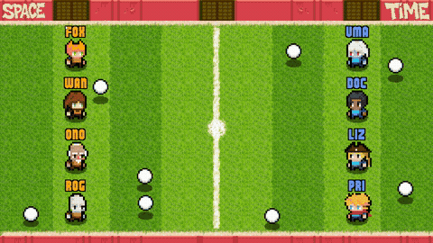

# Space VS Time
This is a personal study/research project. Cute pixelated characters are playing a ball game on a grass field, all while I learned Rust, Rapier and - of course - [SpaceTimeDB](https://spacetimedb.com/docs).



> The game has authoritative server physics and no client prediction.

## Getting started
1. After cloning this repository, run the following command to provision the containerized services described by the [docker-compose.yml](docker-compose.yml) file:
    ```
    docker compose up -d --build
    ```

2. Give it a minute to start properly and then visit this URL on a **Chromium-based browser** to display the game.
    ```
    http://localhost:3001
    ```
    > In case you don't see characters moving on screen, refresh the page a few times or check the container logs for unexpected errors (e.g. ports already in use in your system by other services).

3. (Optional) If you wish to customize the port mappings in the [docker-compose.yml](docker-compose.yml) file, then also remember to update the [index.ts file in the visualization project](./visualization/src/index.ts#L8).

## Administrative access
The [server](./server/) SpaceTimeDB module defines various reducers. Some of them are meant to be called by the administrator to control various aspects of the game.

You can get the Administrator token by looking at the `space-vs-time-server` container logs. Something like this will show up.
```
=== ADMIN TOKEN ===
spacetimedb_token = "eyJ0eXAiOiJKV1QiLCJhbGci...Oyw"
```

Then, visit the Administrative Interface by Julien Lavocat available at [https://stdb-admin.jlavocat.eu/](https://stdb-admin.jlavocat.eu/) and input these informations:
- Instance URL: `http://localhost:3000`
- Database name: `space-vs-time`
- Token: _the token you got from the logs - only use the long string between quotes_


## Projects
This repository contains three projects:

- [server](./server/) it's the [SpaceTimeDB](https://spacetimedb.com/docs) server module written in Rust. The module is using [Rapier](https://rapier.rs/docs/) for server-side authoritative 3D physics;
- [simulation](./simulation/): it's a .NET 8 client application which manages all the players and their actions;
- [visualization](./visualization/): it's a TypeScript client application which renders the action as HTML and CSS.

## Reducers
Some of the reducers defined in the [server](./server/) project are meant for users, while others for the administrator.

### User reducers
Find them in [server/src/reducers/user.rs](./server/src/reducers/user.rs). Most notable ones are:

- `join(name: String)` lets a user join a game with one of the preset characters names;
- `move_to(x: f32, y: f32)` moves a character to a specific location on the field. If the character collides with a ball, it automatically picks it up;
- `throw_to(x: f32, y: f32)` throws a ball (assuming the player had picked one up) at a specific location on the field;
- `say(text: String)` makes the character speak a text of maximum length 12.

### Administrator reducers
Find them in [server/src/reducers/administrator.rs](./server/src/reducers/administrator.rs).

Most notable ones are:

- `set_game_auto_start(enable: bool)` enables or disables the auto-restart when a game ends. If set to `false`, the intro screen when a game ends;

- `start_game(duration: u8)` manually starts a new game, setting its duration;

- `spawn_all_balls(count: u8)` spawns additional balls on both sides of the field;

- `impulse(name: String, x: f32, y: f32)` applies an impulse to a player or ball, modifying its current velocity;

- `test(name: String)` recreates a specific game situation. Used for test purposes.

### Lifecycle reducers
Find them in [server/src/reducers/lifecycle.rs](./server/src/reducers/lifecycle.rs). Check out the `update` scheduled reducer in particular which is the one triggering the Systems.

## The ECS pattern
The [server](./server) project loosely follows the [ECS pattern](https://en.wikipedia.org/wiki/Entity_component_system).
  * **Systems** are in [server/src/ecs/systems/](./server/src/ecs/systems/). They mutate the components state in a choreography. Mind that a choreography strategy might not be suitable for a larger project. In that case evaluate orchestration instead;
  * **Components** are in [server/src/ecs/components/](./server/src/ecs/components/). They carry the data which gets sent to the clients. Some of them are on public SpaceTimeDB tables, while other are private;
  * **Entities** are not really present here. I use SpaceTimeDB's `ReducerContext` to locate components beased on a shared primary key of type `String`. In the future, I might refactor the project to properly use Entities.

## Audio
The [visualization](./visualization/) project plays sound and music in background. If you don't hear anything, try allowing autoplay for media in your browser. This guide explains how.
https://pyrosign.com/articles/how-to-enable-autoplay-for-media-in-browsers

## Credits
- Backend uses [SpaceTimeDB](https://spacetimedb.com/) by [ClockworkLabs](https://clockworklabs.io/) under [SpaceTimeDB Business Source License](https://github.com/clockworklabs/SpacetimeDB/blob/master/LICENSE.txt);
- Backend physics engine is [Rapier](https://rapier.rs/docs/) by [Dimforge](https://dimforge.com/) under [Apache License 2.0](https://github.com/dimforge/rapier/blob/master/LICENSE);
- SpaceTimeDB [Administration interface by Julien Lavocat at github.com](https://github.com/JulienLavocat/SpacetimeDB-Admin) under 
- Background music ["bgm_action_4" by CodeManu available at opengameart.org](https://opengameart.org/content/8-bit-music-pack-loopable) used under [CC-BY 3.0](http://creativecommons.org/licenses/by/3.0/) license;
- Title screen voice "Space VS Time" generated for free at [elevenlabs.io](https://elevenlabs.io/text-to-speech), the edited using [Audacity](https://www.audacityteam.org/); 
- Sound FX generated at [sfxr.me](https://sfxr.me/) and used under 
- Character sprites based on work by [MoDsama available at itch.io](https://modsama.itch.io/4ssplatform), acquired under paid license; 
- Field ground composed from [Mack's tileset for RPG Maker XV](https://vxresource.wordpress.com/2010/03/17/the-real-macks-tileset/);
- Lettering gradient from ["Dithering/Gradient Study" by JayCaution available at deviantart.com](https://www.deviantart.com/jaycaution/art/Dithering-Gradient-Study-Pixel-Art-769533100);
- Stadium backwall from "Football Stadium Pixel Art" by [raulhedgebomber at deviantart.com](https://www.deviantart.com/raulhedgebomber/art/My-Custom-Sprites-Football-Stadium-Pixel-Art-856190502);
- Font ["He's on Fire" by Jamie (JimmyN64) available at fontstruct.com](https://fontstruct.com/fontstructions/show/748820/he_s_on_fire) under [CC BY-SA 3.0](http://creativecommons.org/licenses/by-sa/3.0/);
- Font ["PressStart2P" by codeman38 at fontspace.com](https://www.fontspace.com/press-start-2p-font-f11591) under [SIL Open Font License](https://openfontlicense.org/).

## Thanks
Thanks to the Clockwork Labs devs and other members of the [SpaceTimeDB Discord server](https://discord.gg/spacetimedb) for their help and friendliness.
Also thanks to my employer [CodicePlastico](https://codiceplastico.com/) for allowing development during working hours.

Made with ❤️ in Marche, Italy.